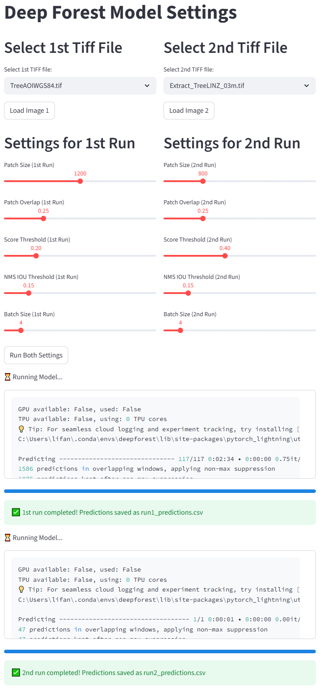
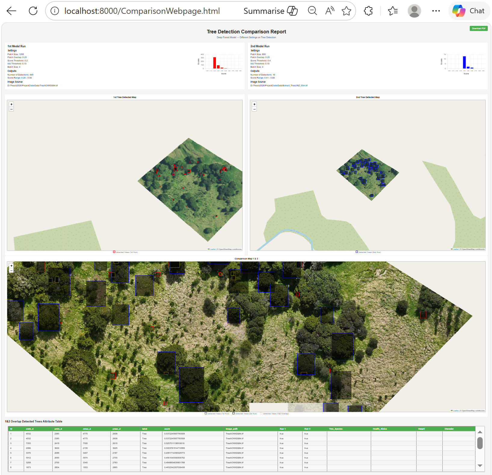

# Workflow Automation of Tree Detection Visualization Comparison(Deep Forest Model)

## Introduction
This is an automatic workflow  to complete from the first step importing data to the last step generating reports for the whole process of comparing tree detection results of DeepForest model.

## Method
- Frontend: Streamlit + html
- Backend: Postgresql
- Geoprocess: Overlap, Add attribute, Convert to Geojson, Upload to PostGIS
## Project Folder
- data
  - TreeAOIWGS84.tif
  - Extract_TreeLINZ_03m.tif
- Output
  - run1_predictions.geojson
  - run2_predictions.geojson
  - run1_predictions.csv
  - run2_predictions.cvs
  - settings.csv
  - ComparisonReport.pdf
- run_tile.py
- settingGUI.py
- ObjectDetectVisualComp.ipynb
- ComparisonWebpage.html

## Results
### 1. Model Setting

### 2. Comparison Report

### 3. Settings.csv (Relational Table)

|  | patch_size | patch_overlap | score_threshold | iou_threshold | batch_size |file_name |
| -------- | -------- | -------- | -------- | -------- | -------- | -------- |
| Run 1   | 1200   | 0.25   | 0.2 | 0.15 | 4 |run1_predictions |
| Run 2   | 800   | 0.25   | 0.4 | 0.15 | 4 | run2_predictions |

### 4. Geojson file attribute Table

| xmin | ymin | xmax | ymax | label | score | image_path | geometry | 
| -------- | -------- | -------- |-------- | -------- | -------- |-------- | -------- |
| 4733   | 1802   | 4799   |1876   | Tree  | 0.560285925865173   |TreeAOIWGS84.tif   | POLYGON ((4799 1802, 4799 1876, 4733 1876, 4733 1802, 4799 1802))   |
| 4532   | 2385   | 4775   |2608   | Tree   | 0.53722459077835   | TreeAOIWGS84.tif   | POLYGON ((4775 2385, 4775 2608, 4532 2608, 4532 2385, 4775 2385))   |
| ...   |    |    |   |    |    |    |    |

## Demo
